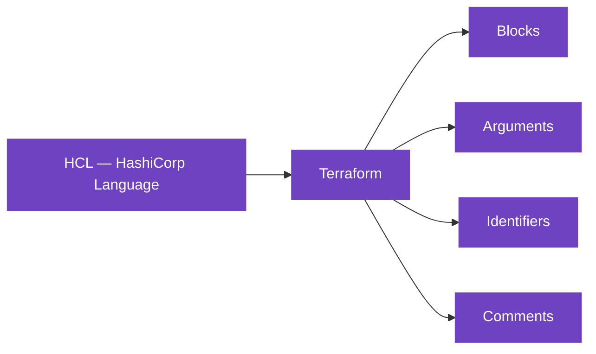

# Terraform Language Basics

## Files

Code in the Terraform language is stored in pain text files with the .tf file extension.

We can call Terraform COnfiguration Files or Terraform Manifests.

## Configuration Sintax

## Arguments
Configura a particular resource: becuase of this many arguments are resource specific. Arguments can be `required` or `optional`.

## Attributes
Values exposed by a particular resource. References to resource attributes takes the format resourse_type.resource_name.attribute_name.

## Meta-arguments
change a resource type's behavior, and are not resource specific. For example, ``count`` and ``for_each``.

## Top level blocks

Terraform language uses a limited number of top-level block types, which are blocks that can appear outside of any other block in a TF configuration file.

### Fundamental Block
 - Terraform Block
 - Providers Block
 - Resources Block

### Variable Blocks
 - Input Variables
 - Output Variables
 - Local Values

### Calling / Referencing Blocks
 - Data Sources
 - Modules
