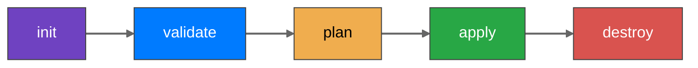

# Terraform Workflow

**Init**: 
 - Used to initialize a working directory containing terraform config files.
 - This is the first command that should be run after writing a new Terraform configuration
 - Downloads providers

**Validate**:
 - Validates the terraform configuration files in that respective diretcory to ensure they are syntactically valid abd internally consistent.
  
**Plan**:
 - Creates an execution plan
 - Terraform performs a refresh and determines what actions are necessary to achieve the desired state specified in the configuration files.

**Apply**:
 - Used to apply the changes reuired to reach the desired state of the configuration.

**Destroy**:
 - Used to destroy the Terraform infrastructure.