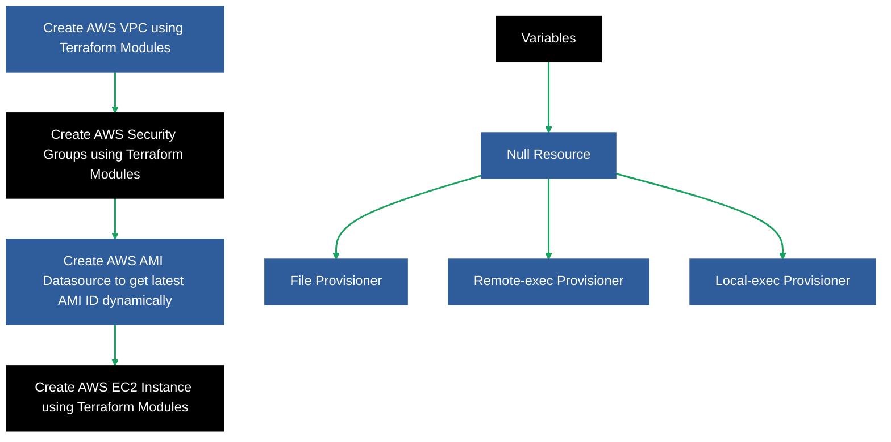

# What will be implemented

```mermaid
flowchart TB
	VPC[Create AWS VPC using Terraform Modules]
	SG[Create AWS Security Groups using Terraform Modules]
	AMI[Create AWS AMI Datasource to get latest AMI ID dynamically]
	EC2[Create AWS EC2 Instance using Terraform Modules]

	VARS[Variables]
	NULLR[Null Resource]
	FILEP[File Provisioner]
	REMOTE[Remote-exec Provisioner]
	LOCAL[Local-exec Provisioner]

	VPC --> SG
	SG --> AMI
	AMI --> EC2

	VARS --> NULLR
	NULLR --> FILEP
	NULLR --> REMOTE
	NULLR --> LOCAL

	style VPC fill:#2f5d9b,color:#ffffff,stroke:#2f5d9b,stroke-width:2px
	style SG fill:#000000,color:#ffffff,stroke:#000000,stroke-width:2px
	style AMI fill:#2f5d9b,color:#ffffff,stroke:#2f5d9b,stroke-width:2px
	style EC2 fill:#000000,color:#ffffff,stroke:#000000,stroke-width:2px
	style VARS fill:#000000,color:#ffffff,stroke:#000000,stroke-width:2px
	style NULLR fill:#2f5d9b,color:#ffffff,stroke:#2f5d9b,stroke-width:2px
	style FILEP fill:#2f5d9b,color:#ffffff,stroke:#2f5d9b,stroke-width:2px
	style REMOTE fill:#2f5d9b,color:#ffffff,stroke:#2f5d9b,stroke-width:2px
	style LOCAL fill:#2f5d9b,color:#ffffff,stroke:#2f5d9b,stroke-width:2px

	linkStyle 0 stroke:#1aa260,stroke-width:2px
	linkStyle 1 stroke:#1aa260,stroke-width:2px
	linkStyle 2 stroke:#1aa260,stroke-width:2px
	linkStyle 3 stroke:#1aa260,stroke-width:2px
	linkStyle 4 stroke:#1aa260,stroke-width:2px
	linkStyle 5 stroke:#1aa260,stroke-width:2px
	linkStyle 6 stroke:#1aa260,stroke-width:2px
```

