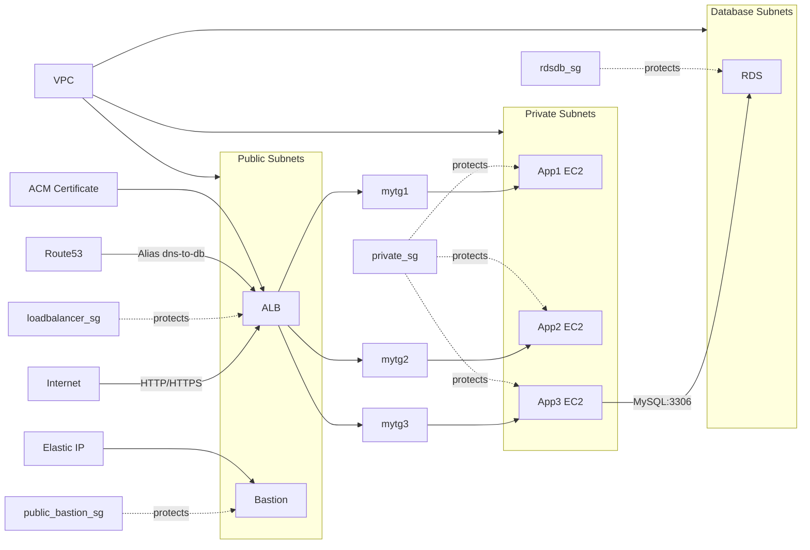

# DNS to DB (Terraform)

This folder (`terraform-manifests`) provisions a small VPC-based application stack:

- VPC with public, private and database subnets
- Bastion host (public) with Elastic IP and `public_bastion_sg`
- Application EC2 instances (private) in three groups: `ec2_private_app1`, `ec2_private_app2`, `ec2_private_app3` (all using `private_sg`)
- Application Load Balancer (ALB) in public subnets using `loadbalancer_sg` and three target groups (`mytg1`, `mytg2`, `mytg3`)
- RDS MySQL database (`module.rdsdb`) in database subnets using `rdsdb_sg`
- ACM certificate (DNS-validated) and a Route53 alias record pointing `dns-to-db.devopsincloud.com` to the ALB

Files of interest (under `terraform-manifests`):

- c4-02-vpc-module.tf — VPC module and subnet definitions
- c5-03-securitygroup-bastionsg.tf — `public_bastion_sg`
- c5-04-securitygroup-privatesg.tf — `private_sg`
- c5-05-securitygroup-loadbalancersg.tf — `loadbalancer_sg`
- c5-06-securitygroup-rdsdbsg.tf — `rdsdb_sg`
- c7-03-ec2instance-bastion.tf — Bastion host (`ec2_public`)
- c7-04-ec2instance-private-app1.tf — App1 EC2 module
- c7-05-ec2instance-private-app2.tf — App2 EC2 module
- c7-06-ec2instance-private-app3.tf — App3 EC2 module (uses RDS endpoint in `user_data`)
- c10-02-ALB-application-loadbalancer.tf — ALB, listeners, target groups and attachments
- c11-acm-certificatemanager.tf — ACM certificate (DNS validation)
- c12-route53-dnsregistration.tf — Route53 A (alias) record to the ALB
- c13-02-rdsdb.tf and c13-03-rdsdb-outputs.tf — RDS module and outputs

Mermaid diagram (high-level architecture):

Notes:

- `module.ec2_private_app3` injects the RDS endpoint into its `user_data` (see `c7-06-ec2instance-private-app3.tf`).
- ALB target groups are attached to the EC2 instances using `aws_lb_target_group_attachment` resources in `c10-02-ALB-application-loadbalancer.tf`.
- Route53 record `dns-to-db.devopsincloud.com` is created in `c12-route53-dnsregistration.tf` as an Alias to the ALB DNS name.

If you'd like, I can also generate an exportable PNG/SVG of the mermaid diagram or expand the README with the Terraform commands and outputs. 
